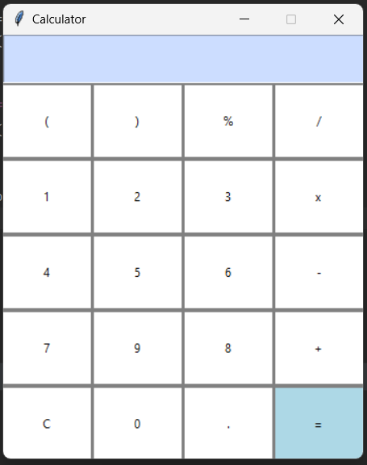

# Simple-Calculator-using-Tkinter-GUI-Python
Practice-Tkinter GUI in Python.

<h1>Tkinter Programming?</h1>
Tkinter is the standard GUI library for Python. Python when combined with Tkinter provides a fast and easy way to create GUI applications. Tkinter provides a powerful object-oriented interface to the Tk GUI toolkit.

The tkinter package includes following modules −

    ✔️Tkinter − Main Tkinter module.
    
    ✔️tkinter.colorchooser − Dialog to let the user choose a color.
    
    ✔️tkinter.commondialog − Base class for the dialogs defined in the other modules listed here.
    
    ✔️tkinter.filedialog − Common dialogs to allow the user to specify a file to open or save.
    
    ✔️tkinter.font − Utilities to help work with fonts.
    
    ✔️tkinter.messagebox − Access to standard Tk dialog boxes.
    
    ✔️tkinter.scrolledtext − Text widget with a vertical scroll bar built in.
    
    ✔️tkinter.simpledialog − Basic dialogs and convenience functions.
    
    ✔️tkinter.ttk − Themed widget set introduced in Tk 8.5, providing modern alternatives for many of the classic widgets in the main tkinter module.

<h1>Tkinter Widgets</h1>
Tkinter provides various controls, such as buttons, labels and text boxes used in a GUI application.
